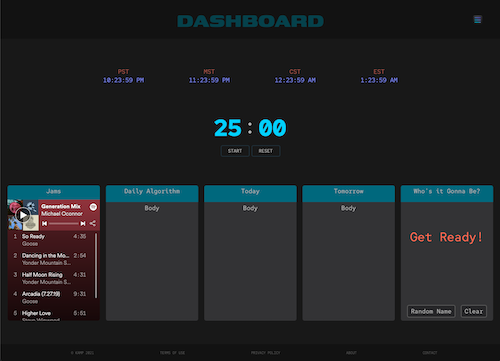

# Generation Daily Dashboard

In progress: A functional classroom dashboard with useful visual tools such as a live timezone display for easy time conversion, a timer for activities, random name picker, embedded custom Generation Spotify playlist & more TBD

## Table of Contents

- [Description](#generation-daily-dashboard)
- [Dev Road Map](#development-road-map)
- [Contributing](#contributing)
- [Technologies](#tech)
- [Visuals](#visuals)
- [Links](#links)
- [Installation](#installation)
- [Contact Us](#questions)
- [License](#license)

### Development Road Map

In progress

## Contributing

- Kathryn Wilkinson: <https://github.com/NAHco-code>
- Michael Oconnor: <https://github.com/oconnor97>
- Alyssa Wilson: <https://github.com/awilson80>
- Jon Jackson: <https://github.com/ocskier>

If you have something you'd like to contribute, make a pull request!

### Tech

- tech 1
- tech 2
- tech 3

### Visuals

### Links

[DeployedApp](<https://generation-resources.github.io/Daily-Dashboard/>) (GitHub Pages)
[GitHub Repo](<https://github.com/Generation-Resources/Daily-Dashboard.git>)

### Installation

Installation instructions...

## Questions?

Please feel free to contact us with any questions via email.

- [kathrynxwilk@gmail.com](kathrynxwilk@gmail.com)
- [moconnor0813@gmail.com](moconnor0813@gmail.com)
- [alyssawilson308@gmail.com](alyssawilson308@gmail.com)
- [ocskier@gmail.com](ocskier@gmail.com)

## License

This project is licensed under the MIT License.
For more information, please visit: [MIT Explained](https://choosealicense.com/licenses/mit/)

&copy; 2021 k.wilkinson | m.oconnor | a.wilson | j.jackson
